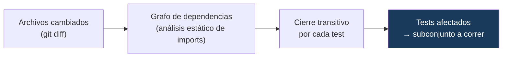
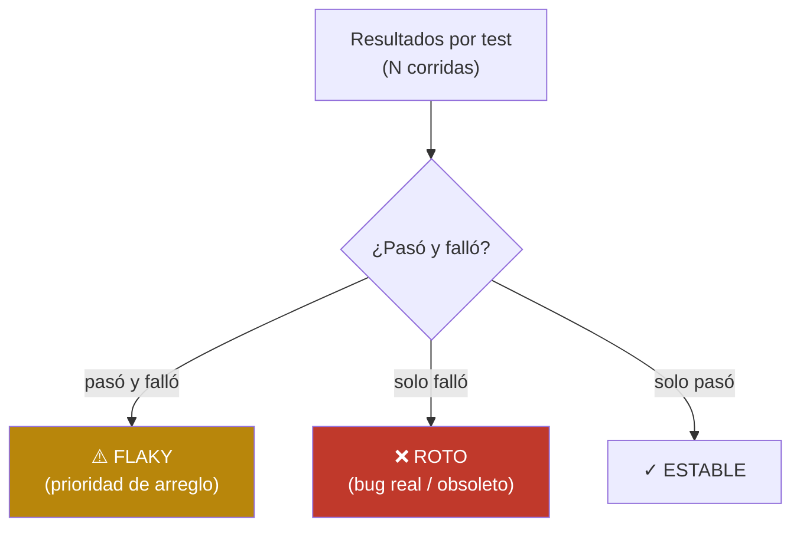

# qa-insights — Herramienta interna de QA

CLI de **developer experience** para equipos de calidad, con dos capacidades que reducen el tiempo de feedback y mejoran la confiabilidad de la suite: **Test Impact Analysis** (correr solo los tests afectados por un cambio) y **detección de flakiness** (clasificar y priorizar tests inestables a partir del histórico de corridas).

---

## Resumen ejecutivo

| | |
|---|---|
| **Qué es** | Una herramienta de línea de comandos, sin dependencias de runtime, que analiza un proyecto de tests y su histórico de ejecución. |
| **Problema que resuelve** | (1) Correr toda la suite en cada cambio es lento y caro. (2) Los tests inestables (flaky) erosionan la confianza, y a menudo se confunden con tests genuinamente rotos. |
| **Enfoque** | Análisis estático del grafo de dependencias para acotar qué correr; análisis del histórico de resultados para clasificar la salud de cada test. |
| **Resultado** | Feedback más rápido (menos tests por PR) y una lista priorizada y accionable de tests flaky vs rotos. La propia herramienta está cubierta por tests. |
| **Stack** | TypeScript · Node · Vitest (sin dependencias de runtime) |

---

## Capacidad 1 — Test Impact Analysis

Ante un cambio, en vez de correr toda la suite, corre **solo los tests afectados**: los que cambiaron o los que dependen —directa o transitivamente— de un archivo modificado.



Ejemplo real (sobre el proyecto de muestra): un cambio en `math.ts` afecta a `math.spec` y a `discount.spec` (que importa `math` de forma transitiva), pero **no** a `format.spec`. Se evita correr los tests no relacionados.

```
$ qa-insights impact --project sample-project --changed sample-project/src/math.ts

Tests en el proyecto: 3
Tests AFECTADOS     : 2  (se evita correr 1)
   • tests/discount.spec.ts
   • tests/math.spec.ts
```

---

## Capacidad 2 — Detección de flakiness

A partir del histórico de corridas, clasifica cada test y produce un reporte priorizado.



La distinción **flaky vs roto** es clave: un test que falla *siempre* no es flakiness, es un bug real o un test obsoleto — tratarlo como "ruido" es un error.

```
$ qa-insights flaky --results sample-results

═══════════ SALUD DE LA SUITE ═══════════
  Tests analizados      : 5
  Flaky                 : 1 (20% de la suite)
  Rotos (fallan siempre): 1

⚠️  TESTS FLAKY (prioridad de arreglo):
    40%  el badge del carrito se actualiza  (3✓ / 2✗ en 5 corridas)

❌ TESTS ROTOS (NO es flakiness, es un bug real o test obsoleto):
   reporte de ventas exporta PDF
```

---

## Arquitectura

```
src/
├── impact/
│   ├── dependency-graph.ts   # análisis estático de imports → grafo
│   └── test-impact.ts        # cierre transitivo → tests afectados
├── flaky/
│   ├── parse.ts              # carga del histórico de corridas
│   └── analyze.ts            # clasificación stable / flaky / broken
├── report.ts                 # formateo del reporte
└── cli.ts                    # interfaz de línea de comandos
tests/                        # tests de la PROPIA herramienta (Vitest)
sample-project/               # proyecto de muestra para el impact analysis
sample-results/               # histórico de corridas de muestra
```

> Una herramienta de calidad **debe estar cubierta por tests**: `tests/` valida el grafo de dependencias, el impact analysis y la clasificación de flakiness.

---

## Uso

```bash
npm install

# Test Impact Analysis
npm run cli -- impact --project <ruta> --changed <archivo1,archivo2>
npm run cli -- impact --project <ruta> --since main      # deriva los cambios de git

# Detección de flakiness
npm run cli -- flaky --results <directorio-de-corridas>

# Demos y verificación
npm run demo:impact
npm run demo:flaky
npm test           # tests de la herramienta
npm run typecheck
```

---

## Documentación técnica

**[docs/DOCUMENTACION-TECNICA.md](docs/DOCUMENTACION-TECNICA.md)** detalla: el análisis estático de dependencias, el cálculo del cierre transitivo, la clasificación de flakiness (y por qué distinguir flaky de roto), el formato de resultados y las vías de extensión (aliases de tsconfig, adaptadores de reporters, integración en CI).

---

## Contexto

Parte de una serie de proyectos de automatización de calidad orientados a perfiles QA Automation y SDET, con foco en **tooling que multiplica al equipo**.

---

## Licencia

MIT.
